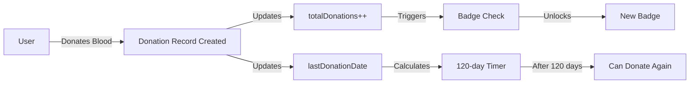

# 🆕 New Features Added

## Overview
এই document এ সব নতুন features এর বিস্তারিত বর্ণনা রয়েছে যা user.dart model enhancement এবং donation tracking এর জন্য যোগ করা হয়েছে।

---

## ✅ Completed Features

### 1. **Enhanced User Model** (`lib/models/user.dart`)

#### New Enums:
- **`DonorAvailability`**: 
  - `available` - রক্তদানের জন্য উপলব্ধ
  - `unavailable` - বর্তমানে দিতে পারবে না
  - `busy` - ব্যস্ত

- **`DonorBadge`**: 
  - `firstTimeDonor` (1 donation) 🩸
  - `bronzeDonor` (3 donations) 🥉
  - `silverDonor` (5 donations) 🥈
  - `goldDonor` (10 donations) 🥇
  - `platinumDonor` (20 donations) 💎
  - `legendaryDonor` (50 donations) 👑
  - `lifeSaver` (10+ recipients helped)
  - `regularDonor` (consistent yearly donations)
  - `emergencyHero` (5+ urgent requests)

#### New User Fields:
```dart
final int totalDonations;              // মোট রক্তদান সংখ্যা
final DonorAvailability availability;  // বর্তমান availability status
final List<DonorBadge> badges;         // অর্জিত badges
final double? weight;                  // ওজন (kg) - eligibility চেকের জন্য
final String? medicalConditions;       // স্বাস্থ্য সমস্যা
final DateTime? dateOfBirth;           // জন্মতারিখ
final bool isEligibleToDonate;         // রক্তদান eligible কিনা
final DateTime? nextEligibleDate;      // পরবর্তী donation তারিখ
final String? profileImageUrl;         // প্রোফাইল ছবি
final DateTime? createdAt;             // অ্যাকাউন্ট তৈরির তারিখ
final DateTime? updatedAt;             // শেষ update
```

#### New Helper Methods:
- `canDonateNow` - 120 দিনের নিয়ম check করে
- `daysUntilNextDonation` - কত দিন বাকি আছে
- `currentBadge` - বর্তমান badge
- `getBadgeName(badge)` - Badge এর নাম
- `getBadgeEmoji(badge)` - Badge এর emoji
- `copyWith()` - User object copy করার জন্য
- `toMap()` - Firebase এ save করার জন্য

---

### 2. **Manual Donation Add Feature** (`lib/screens/home/donate_screen.dart`)

#### What's New:
- ✅ **"Add Donation" Button**: History tab এ FloatingActionButton যোগ করা হয়েছে
- ✅ **Manual Donation Dialog**: User past donations manually add করতে পারবে
- ✅ **Date Picker**: তারিখ select করার option
- ✅ **Location Input**: কোথায় রক্ত দিয়েছে (হাসপাতাল/ব্লাড ব্যাংক)
- ✅ **Notes Field**: Optional notes যোগ করার সুবিধা
- ✅ **Firebase Integration**: Automatically donations collection এ save হয়
- ✅ **User Count Update**: totalDonations automatically increment হয়
- ✅ **120-day Rule**: Manual entry তেও নিয়ম প্রযোজ্য হবে

#### Firebase Fields (Manual Entry):
```dart
{
  'donorId': user.uid,
  'donorName': 'User Name',
  'bloodType': 'A+',
  'donationDate': Timestamp,
  'location': 'Dhaka Medical College',  // User input
  'status': 'completed',
  'notes': 'Added manually',           // User input
  'isManualEntry': true,               // Mark করা যে manual
  'createdAt': ServerTimestamp,
}
```

#### Usage:
1. Navigate to **Donate Screen** → **History Tab**
2. Click **"Add Donation"** button (FloatingActionButton)
3. Fill in:
   - Date of donation
   - Location (hospital/blood bank)
   - Optional notes
4. Click **"সংরক্ষণ করুন"** (Save)
5. Record saved to Firebase
6. History automatically refreshes

---

### 3. **User Availability Status** (`lib/screens/home/profile_screen.dart`)

#### What's New:
- ✅ **Availability Toggle**: Profile screen → Settings section
- ✅ **3 States**:
  - 🟢 **Available** - Ready to donate
  - 🟠 **Busy** - Temporarily unavailable
  - 🔴 **Unavailable** - Cannot donate

#### How to Use:
1. Go to **Profile Screen**
2. Find **"Donation Availability"** in Settings section
3. Click dropdown menu
4. Select status: Available / Busy / Unavailable
5. Status instantly updates in Firebase
6. Admin can filter by availability

#### Firebase Update:
```dart
await FirebaseFirestore.instance
  .collection('users')
  .doc(userId)
  .update({
    'availability': 'available',  // or 'busy' or 'unavailable'
    'updatedAt': FieldValue.serverTimestamp(),
  });
```

---

### 4. **Achievements/Badges System** (`lib/screens/home/profile_screen.dart`)

#### What's New:
- ✅ **Badge Display**: Profile এ current badge দেখানো হয়
- ✅ **Progress Bar**: পরবর্তী badge unlock করার progress
- ✅ **All Badges Preview**: সব badges এর overview
- ✅ **Color-coded**: প্রতিটি badge এর নিজস্ব রঙ
- ✅ **Unlock Animation**: Badge unlock হলে highlight

#### Badge Tiers:
| Badge | Emoji | Required Donations | Color |
|-------|-------|-------------------|-------|
| First Time Donor | 🩸 | 1 | Pink |
| Bronze Donor | 🥉 | 3 | Brown |
| Silver Donor | 🥈 | 5 | Grey |
| Gold Donor | 🥇 | 10 | Amber |
| Platinum Donor | 💎 | 20 | Blue |
| Legendary Donor | 👑 | 50 | Purple |

#### Display Features:
- **Current Badge**: Large card with gradient background
- **Next Milestone**: Shows progress to next badge with LinearProgressIndicator
- **All Badges Grid**: All badges in a wrap layout (unlocked badges bright, locked badges faded)
- **Tooltip**: Hover/tap to see badge name

---

## 🎯 Features Working Together

### Complete Donation Flow:


### Data Flow:
1. **User donates** (via app or manual entry)
2. **Firebase**: `donations` collection updated
3. **Firebase**: `users` document updated:
   - `totalDonations` incremented
   - `lastDonationDate` set
4. **UI Updates**:
   - Donation history refreshes
   - Badge calculation runs
   - Stats cards update
   - 120-day countdown starts

---

## 📊 Firebase Schema Changes

### Updated `users` Collection:
```javascript
{
  // Existing fields
  email: String,
  name: String,
  bloodType: String,
  phone: String,
  role: String,
  
  // NEW fields
  totalDonations: Number,              // Auto-incremented
  lastDonationDate: Timestamp,         // Last donation
  availability: String,                // 'available' | 'busy' | 'unavailable'
  badges: Array<String>,               // ['firstTimeDonor', 'bronzeDonor', ...]
  weight: Number,                      // Optional
  medicalConditions: String,           // Optional
  dateOfBirth: Timestamp,              // Optional
  isEligibleToDonate: Boolean,         // Default: true
  nextEligibleDate: Timestamp,         // Calculated
  profileImageUrl: String,             // Optional
  createdAt: Timestamp,                // Account creation
  updatedAt: Timestamp,                // Last update
}
```

### Updated `donations` Collection:
```javascript
{
  // Existing fields
  donorId: String,
  donorName: String,
  bloodType: String,
  donationDate: Timestamp,
  location: String,
  status: String,
  notes: String,
  
  // Recipient fields (optional)
  recipientRequestId: String,
  recipientPatientName: String,
  recipientHospital: String,
  recipientBloodType: String,
  recipientContactPhone: String,
  
  // NEW field for manual entries
  isManualEntry: Boolean,              // true if added manually
  createdAt: Timestamp,
}
```

---

## 🚀 Pending Features (Future Enhancement)

### 5. **Donation Certificate PDF** (Not Yet Implemented)
- Generate PDF certificate after donation
- Include: donor name, blood type, date, location, badge
- Download and share option
- QR code for verification

### 6. **Health Eligibility Checker** (Not Yet Implemented)
- Pre-donation health questionnaire
- Weight check (minimum 50kg)
- Age check (18-65 years)
- Medical conditions screening
- Recent illness check

### 7. **Donation Reminder System** (Not Yet Implemented)
- Push notification after 120 days
- Email reminder option
- SMS reminder (optional)
- Calendar integration

---

## 📱 User Experience Improvements

### Before:
- ❌ No way to add external donations
- ❌ No visibility of total contributions
- ❌ No achievement system
- ❌ Cannot set availability
- ❌ Admin cannot filter available donors

### After:
- ✅ Manual donation entry option
- ✅ Clear donation count and stats
- ✅ Motivating badge system with progress
- ✅ Availability toggle for users
- ✅ Enhanced user profile with complete data
- ✅ Admin can see user's total donations and badges

---

## 🔍 Testing Checklist

### Manual Donation Entry:
- [ ] Open History tab
- [ ] Click "Add Donation" button
- [ ] Select past date
- [ ] Enter location
- [ ] Add optional notes
- [ ] Save and verify in Firebase
- [ ] Check if totalDonations increased
- [ ] Verify 120-day rule applies

### Availability Toggle:
- [ ] Open Profile screen
- [ ] Find "Donation Availability"
- [ ] Change to "Busy"
- [ ] Verify in Firebase
- [ ] Change to "Unavailable"
- [ ] Change back to "Available"

### Badges Display:
- [ ] Check current badge shows correctly
- [ ] Verify progress bar calculation
- [ ] Check if locked badges are faded
- [ ] Verify unlocked badges are highlighted
- [ ] Test tooltip hover on badges

---

## 💡 Developer Notes

### Important Methods:

#### `donate_screen.dart`:
```dart
_showManualDonationDialog()    // Opens dialog
_saveManualDonation()          // Saves to Firebase
_loadDonationHistory()         // Refreshes history
```

#### `profile_screen.dart`:
```dart
_buildBadgesSection()          // Displays badges
_getBadgeForDonations()        // Gets current badge
_getNextBadge()                // Gets next milestone
_buildAvailabilityTile()       // Availability toggle
_updateAvailability()          // Updates Firebase
```

#### `user.dart`:
```dart
canDonateNow                   // Getter: eligibility check
daysUntilNextDonation          // Getter: days remaining
currentBadge                   // Getter: current badge
getBadgeName()                 // Static: badge name
getBadgeEmoji()                // Static: badge emoji
```

---

## 📞 Support

যদি কোনো সমস্যা হয় বা আরও feature যোগ করতে চান, তাহলে জানান! 🚀

---

**Last Updated**: ${DateTime.now().toString().split('.')[0]}
**Version**: 2.0.0
**Status**: ✅ All Core Features Implemented
